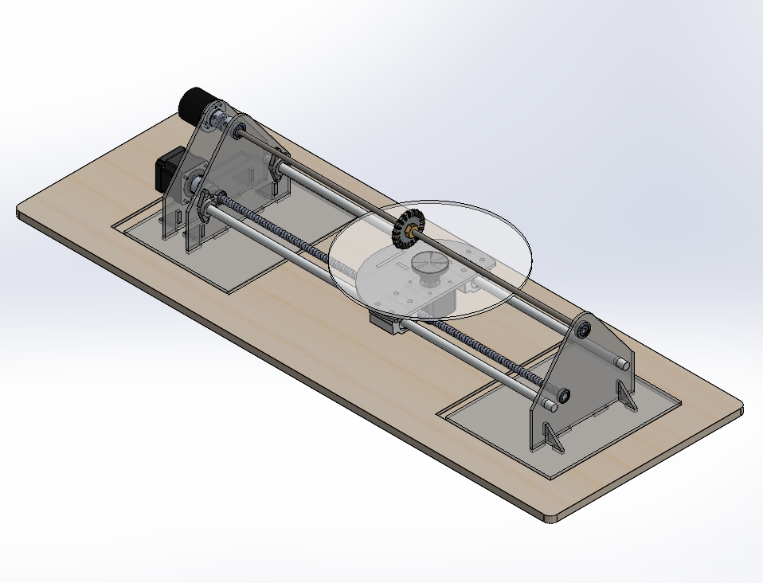
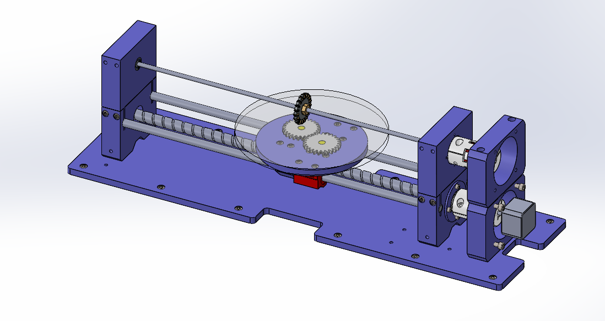
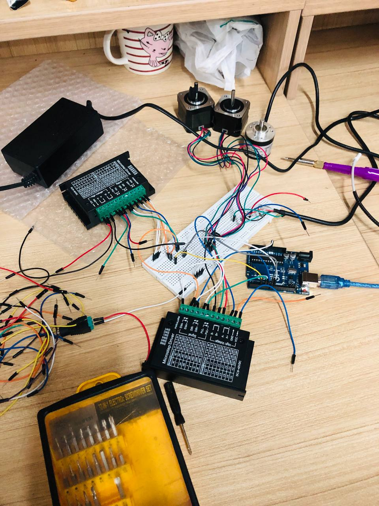
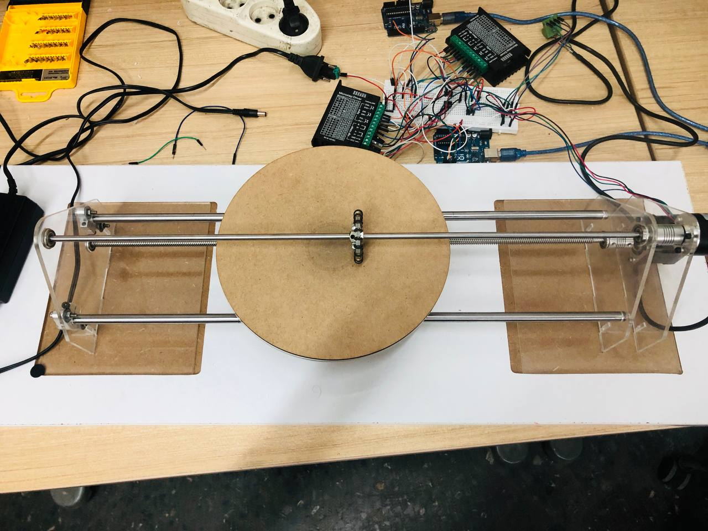

# Mechanical-Integrator
Supervisors: Dr. Arash Bahrami - Dr. Mohsen Hamedi

Check out my [LinkedIn Post about this Project](https://www.linkedin.com/feed/update/urn:li:activity:7223207148728573952/)  

## Project Description
This device works by adjusting the movement of the input to the lower shaft using a stepper motor. The motion is then transferred to another shaft through a series of components such as a lead screw, linear bearing, and rotating disk. 
Finally, the number of revolutions of the final shaft is recorded as the integral's response.

The experience gained in manufacturing and sourcing parts for this project was truly unique. I am deeply grateful to everyone who contributed to the development of this remarkable project within a year.
### Final Setup Designed at SolidWorks

